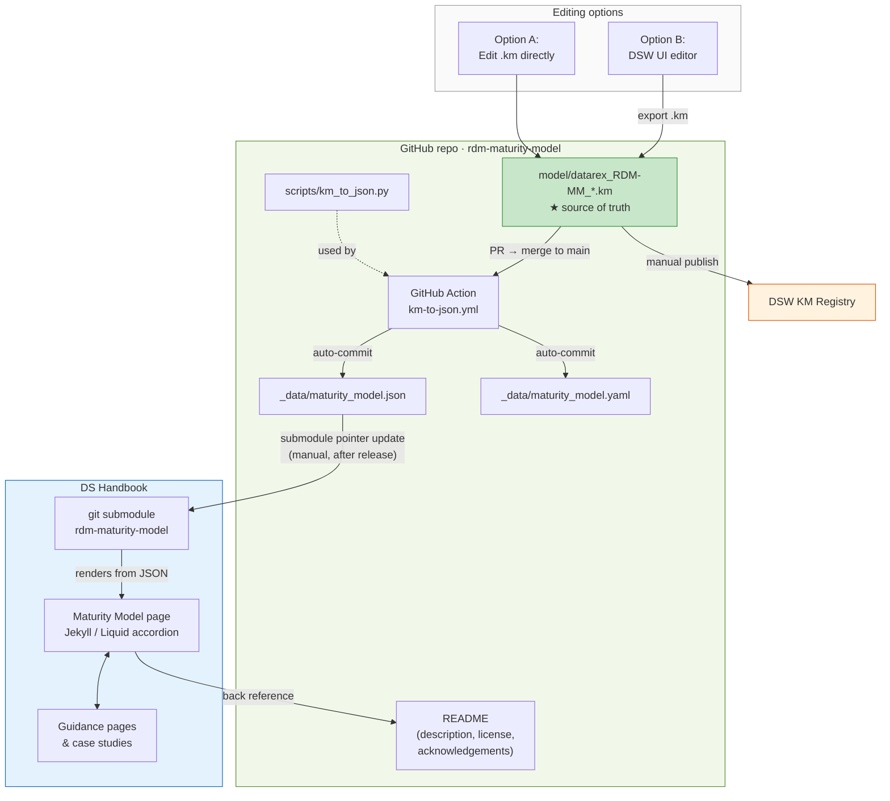

# Contributing

## Repository layout

```
model/          ← source of truth (.km file, edit this)
_data/          ← generated outputs (do not edit manually)
  maturity_model.json
  maturity_model.yaml
scripts/
  km_to_json.py ← extraction script
.github/workflows/
  km-to-json.yml
```

## Architecture Overview



---

## Source of Truth

The **DSW Knowledge Model file** (`model/*.km`) is the single source of truth for the Maturity Model. All other formats (`.json`, `.yaml`) are generated from it automatically by the CI pipeline. Do not edit `maturity_model.json` or `maturity_model.yaml` directly.

---

## Editing the Model

Changes can be made in one of two ways:

### Option A — Edit the `.km` file directly

Open `model/datarex_RDM-MM_<version>.km` in a text editor. The file is JSON-formatted and event-sourced: every change is recorded as a new event appended to the last package in `packages[-1].events`. Do not modify existing events — only append new ones.

Useful event types and their structure are documented in [`scripts/km_to_json.py`](scripts/km_to_json.py).

### Option B — Edit via the DSW Knowledge Model editor

1. Import the `.km` file into a [DSW](https://ds-wizard.org/) instance.
2. Make changes using the DSW UI (questions, answers, annotations, chapter descriptions, etc.).
3. Export the updated `.km` file from DSW.
4. Replace the existing `_data/*.km` file in this repository with the exported file.

---

## Releasing a New Version

### Step 1 — Update the `.km` file

Ensure the KM file contains the correct version number. In the `.km` file, this is the `version` field at the top level and the `id` / `version` fields inside the last package.

Rename the file to match the new version: `datarex_RDM-MM_<version>.km` and place it in `model/`.

### Step 2 — Open a pull request

Commit the updated `.km` file to a branch and open a pull request against `main`. The PR should be reviewed to confirm:

- The KM version matches the filename.
- All changed questions, answers, and annotations are correct.
- Running `python scripts/km_to_json.py` locally produces the expected output.

### Step 3 — Merge and create a GitHub release

After the PR is merged, create a [GitHub release](https://github.com/elixir-europe/rdm-maturity-model/releases/new) with a tag matching the KM version (e.g. `v0.1.2`). Use the same version number as the `versionNumber` field in the KM.

### Step 4 — CI generates JSON and YAML (automated)

Merging to `main` with a changed `.km` file triggers the [`km-to-json`](.github/workflows/km-to-json.yml) GitHub Action, which:

1. Runs `scripts/km_to_json.py` to produce `_data/maturity_model.json`.
2. Converts `maturity_model.json` to `_data/maturity_model.yaml`.
3. Commits both files back to `main` automatically.

> The badge for **"Generate JSON (and YAML) from KM file"** should show a green **passing** status. If not, check the Action logs or the `.km` file for issues.

---

## ds-handbook Integration

The [ds-handbook](https://github.com/elixir-europe/ds-handbook) repository consumes this repository as a **git submodule** and renders the Maturity Model from `maturity_model.json`.

- **Submodule setup** — `rdm-maturity-model` is listed in [ds-handbook/.gitmodules](https://github.com/elixir-europe/ds-handbook/blob/main/.gitmodules). When cloning `ds-handbook`, use `--recurse-submodules`.
- **CI configuration** — The [Jekyll site CI](https://github.com/elixir-europe/ds-handbook) pulls submodule changes before every build.
- **Model usage** — The model is rendered directly from the JSON in Jekyll/Liquid (e.g. [maturity-model.md](https://github.com/elixir-europe/ds-handbook/blob/main/pages/maturity-model.md)).

After a new version is released and the CI has committed the generated files, the `ds-handbook` submodule pointer needs to be updated to the new commit to pick up the changes.

---

## Verifying the Pipeline

After a release, confirm the version number is consistent across all locations:

| Location | Where to check |
|---|---|
| KM file | `version` field in `model/*.km` |
| Generated JSON | `version.versionNumber` in `_data/maturity_model.json` |
| ds-handbook website | [Version information](https://elixir-europe.github.io/ds-handbook/maturity-model#version-information) |
